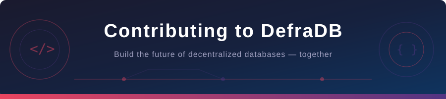
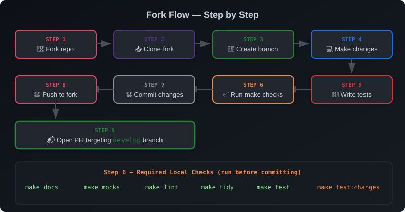
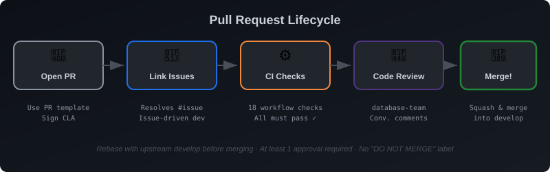

<p align="center">
  
</p>

<p align="center">
  <a href="https://source.network/discord"></a>
  <a href="https://x.com/edgeofsource"></a>
  <a href="https://github.com/sourcenetwork/defradb/blob/develop/licenses/BSL.txt"></a>
  <a href="https://codecov.io/gh/sourcenetwork/defradb"></a>
  <a href="https://goreportcard.com/report/github.com/sourcenetwork/defradb"></a>
</p>

---

# 🎉 Contributing to DefraDB

**Thank you for your interest in contributing to DefraDB!** You're about to join a wave of innovation in decentralized and powerful databases. Every contribution makes a difference - whether it's reporting a bug, improving documentation, suggesting a feature, or writing code.

> [!NOTE]
> 💡 **New here?** The quickest way to get started is to join our [Discord community](https://source.network/discord) and say hello. We're happy to help you find the right place to contribute!

---

<details>
<summary><strong>📑 Table of Contents</strong> <em>(click to expand)</em></summary>

&nbsp;

- [🔐 Security Vulnerabilities](#-security-vulnerabilities)
- [📚 Helpful Resources](#-helpful-resources)
- [🚀 Getting Started](#-getting-started)
- [📖 Documentation](#-documentation)
- [🐛 Reporting Bugs](#-reporting-bugs)
- [💡 Suggesting Enhancements](#-suggesting-enhancements)
- [🌊 Git Workflow](#-git-workflow)
- [📬 Opening a Pull Request](#-opening-a-pull-request)
- [👀 Code Review](#-code-review)
- [🏁 Merging](#-merging)
- [🧪 Testing](#-testing)
- [📣 Community](#-community)

</details>

---

## 🔐 Security Vulnerabilities

> [!CAUTION]
> **Please do NOT file a public issue for security vulnerabilities.**
>
> If you discover a security vulnerability, please disclose it responsibly by emailing **[security@source.network](mailto:security@source.network)**. Our security team will respond within 24 hours.
>
> For full details, see our [Security Policy](./SECURITY.md).

---

## 📚 Helpful Resources

You don't need to be an expert in all of these to contribute - many contributions don't require programming at all! But these resources may be useful depending on what you'd like to work on:

| &nbsp; | Resource | Purpose |
|:------:|----------|---------|
| 🔀 | **[Git](https://training.github.com/)** | Version control basics |
| 📘 | **[Project Docs](https://docs.source.network/)** | Features & architecture |
| 🐹 | **[Go](https://go.dev/doc/install)** | Primary language |
| 🦀 | **[Cargo/rustc](https://www.rust-lang.org/tools/install)** | WASM lens modules |

---

## 🚀 Getting Started

**✅ Required** to build and run DefraDB:

| Tool | Notes |
|------|-------|
| **[Go](https://go.dev/doc/install)** | Check [`go.mod`](./go.mod) for the required version |
| **[Cargo/rustc](https://www.rust-lang.org/tools/install)** | Via `rustup`, needed for WASM lens modules |

**💡 Optional** (needed for specific features/tests):

| Tool | When You Need It |
|------|-----------------|
| **[Vera](https://github.com/sourcenetwork/vera)** | Working on access control features |
| **[Ollama](https://ollama.com/download)** | AI/vector embedding tests |
| **[Make](https://www.gnu.org/software/make/)** | Convenient but not required - you can run `go` commands directly |

**Clone, build, and run:**

```shell
git clone https://github.com/sourcenetwork/defradb.git
cd defradb
make start
```

> [!TIP]
> Refer to the [`README.md`](./README.md) and [project documentation](https://docs.source.network/) for detailed usage examples.

---

## 📖 Documentation

The overall project documentation is at **[docs.source.network](https://docs.source.network)**, with its source at [github.com/sourcenetwork/docs.source.network](https://github.com/sourcenetwork/docs.source.network).

<details>
<summary>📄 <strong>View code documentation locally</strong></summary>

&nbsp;

Go doc comments can be viewed as a website:

```shell
go install golang.org/x/pkgsite/cmd/pkgsite@latest
cd your-path-to/defradb/
pkgsite
# open http://localhost:8080/github.com/sourcenetwork/defradb
```

See [go.dev/doc/comment](https://go.dev/doc/comment) for Go doc comment guidelines.

</details>

| Reference | Location |
|-----------|----------|
| 🌐 HTTP API docs | [`docs/website/references/http/openapi.json`](./docs/website/references/http/openapi.json) |
| 💻 CLI docs | [`docs/website/references/cli/`](./docs/website/references/cli/) |
| 📄 Man pages | Generate with `make docs:manpages` → `build/man/` |

---

## 🐛 Reporting Bugs

Found a bug? Here's how to report it:

1. 🔍 **Search first** - check [existing issues](https://github.com/sourcenetwork/defradb/issues) to avoid duplicates.
2. 📝 **Create a new issue** - go to [github.com/sourcenetwork/defradb/issues](https://github.com/sourcenetwork/defradb/issues), click "New issue", and select **Bug Report**.
3. 📋 **Include helpful details:**

   | What to Include | Example |
   |----------------|---------|
   | Clear description | *"Queries with nested filters return empty results"* |
   | Steps to reproduce | *"1. Add schema... 2. Create document... 3. Query with..."* |
   | Expected vs actual | *"Expected 3 results, got 0"* |
   | Platform info | Use `defradb version` |

> [!TIP]
> The more detail you provide, the faster we can fix it!

---

## 💡 Suggesting Enhancements

Have an idea? Start a [Feature Request discussion](https://github.com/sourcenetwork/defradb/discussions/new?category=feature-request). Explain the problem you're solving and why the enhancement would be useful.

> [!TIP]
> For significant changes, discuss your approach with the team *before* writing code. This saves effort and ensures alignment with the project direction.

---

## 🌊 Git Workflow

We use the **Git Fork Flow** for all contributions:

<p align="center">
  
</p>

| Step | Action |
|------|--------|
| 🍴 **1** | **Fork** the repository on GitHub |
| 📥 **2** | **Clone** your fork and create a **feature branch** |
| 💻 **3** | **Make your changes** |
| ✅ **4** | **Run checks** - `make lint`, `make test`, etc. (see [Testing](#-testing)) |
| 📬 **5** | **Open a pull request** targeting the **`develop`** branch |

---

## 📬 Opening a Pull Request

<p align="center">
  
</p>

### 🔗 Link with Relevant Issue(s)

We follow **issue-driven development** - every pull request **must** be linked to one or more issues. If no issue exists, create one first.

Link an issue using [resolving keywords](https://docs.github.com/en/get-started/writing-on-github/working-with-advanced-formatting/using-keywords-in-issues-and-pull-requests#linking-a-pull-request-to-an-issue) in your PR description:

| Keyword | Example |
|---------|---------|
| `close` / `closes` / `closed` | `Closes #123` |
| `fix` / `fixes` / `fixed` | `Fixes #456` |
| `resolve` / `resolves` / `resolved` | `Resolves #789` |

<details>
<summary>📋 <strong>Example PR description</strong></summary>

&nbsp;

```markdown
## Relevant issue(s)

Resolves #123
```

> The [PR template](./.github/pull_request_template.md) has a `Relevant issue(s)` section for this.

</details>

---

### 🏷️ Title Format

PR titles follow our own convention, close to and inspired by **[Conventional Commits](https://www.conventionalcommits.org/en/v1.0.0/)** (but not identical to it): &nbsp; **`<label>: <Description>`**

**Available labels:**

| Label | &nbsp; | Meaning | Example |
|-------|--------|---------|---------|
| `feat` | ✨ | New feature | `feat: Add document encryption` |
| `fix` | 🐛 | Bug fix | `fix: Resolve API timeout issue` |
| `refactor` | ♻️ | Code refactoring | `refactor: Simplify query parser` |
| `docs` | 📖 | Documentation | `docs: Update API reference` |
| `test` | 🧪 | Testing | `test: Add P2P sync tests` |
| `ci` | 🔧 | CI/CD changes | `ci: Update lint workflow` |
| `chore` | 🧹 | Maintenance | `chore: Update dependencies` |
| `perf` | ⚡ | Performance | `perf: Optimize index lookups` |
| `tools` | 🔨 | Tooling | `tools: Add benchstat script` |
| `bot` | 🤖 | Automated (bot only) | `bot: Bump go version` |

**Rules:**

| &nbsp; | Rule | &nbsp; |
|--------|------|--------|
| 1️⃣ | Colon + **single space** after label | ✅ `fix: Resolve issue` &nbsp;&nbsp; ❌ `fix:Resolve issue` |
| 2️⃣ | Description starts with **capital letter** | ✅ `docs: Improve README` &nbsp;&nbsp; ❌ `docs: improve README` |
| 3️⃣ | Description **should** start with an [**action verb**](https://gist.github.com/scmx/411f6fea4ee3832806720d536a7d5d8f) | *Add, Update, Fix, Remove, Refactor...* |
| 4️⃣ | Last character must be **alphanumeric** | No trailing `.` `)` or special characters |
| 5️⃣ | Title must **not exceed 60 characters** (except `bot`) | Keep it concise! |
| 6️⃣ | *Optional:* suffix the label with **`(i)`** to mark an **internal** change (no user-facing impact) - it is left out of the release changelog | `docs(i): Update contributing guidelines` |

> 📌 More examples in [`tools/scripts/scripts_test.sh`](./tools/scripts/scripts_test.sh).

---

### ✍️ Sign the CLA

First-time contributors will be asked to sign the **Contributor License Agreement (CLA)**. The CLA bot will comment on your PR with instructions.

---

## 👀 Code Review

Request a review from the **database-team**. After receiving feedback, please try to respond within **two weeks** to keep the conversation moving.

Reviewers prefix their comments with labels inspired by **[Conventional Comments](https://conventionalcomments.org/)** to clarify intent and whether a comment is blocking, see the [Commenting Etiquette guide](./CONTRIBUTING_INTERNAL.md#-commenting-etiquette) for what each label means and what action is expected.

---

## 🏁 Merging

> [!IMPORTANT]
> **A PR is ready to merge when:**
>
> - ✅ All CI checks are passing
> - 👍 At least **one approval**
> - 🚫 No `DO NOT MERGE` label
> - 🔄 Rebased with the upstream `develop` branch

We use **[Squash and Merge](https://docs.github.com/en/pull-requests/collaborating-with-pull-requests/incorporating-changes-from-a-pull-request/about-pull-request-merges)** - all commits get squashed into one. Your PR title becomes the commit message, so make sure it follows the [title format](#-title-format).

Once approved and CI passes, let a maintainer know and they'll merge it for you.

---

## 🧪 Testing

```shell
make test     # Run unit and integration tests
make lint     # Run linters
```

Benchmarks can be found in the [`tests/bench/`](./tests/bench/) directory.

> [!TIP]
> If `make` isn't available, you can run `go test ./...` directly.

---

## 📣 Community

We'd love to hear from you!

| &nbsp; | Channel | Purpose |
|:------:|---------|---------|
| 💬 | **[Discord](https://source.network/discord)** | Real-time chat & Q&A |
|  | **[X](https://x.com/edgeofsource)** | Updates & announcements |
| 💻 | **[Discussions](https://github.com/sourcenetwork/defradb/discussions)** | Feature ideas & long-form chats |

---

<p align="center">
  <br>
  <b>🙏 Thank you for contributing to DefraDB!</b>
  <br>
  <sub>Together, we're building the future of decentralized databases 🚀</sub>
  <br><br>
</p>
