# DefraDB Architechture

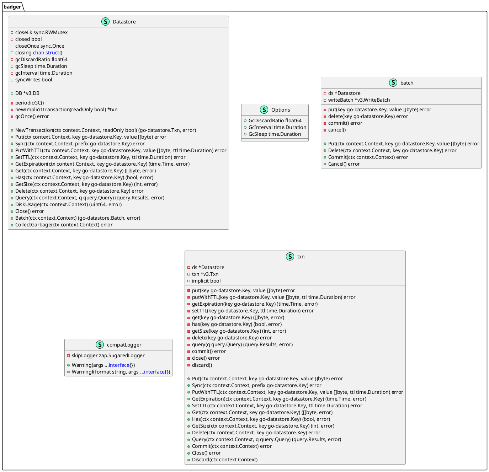


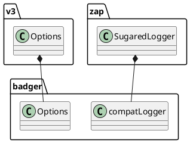


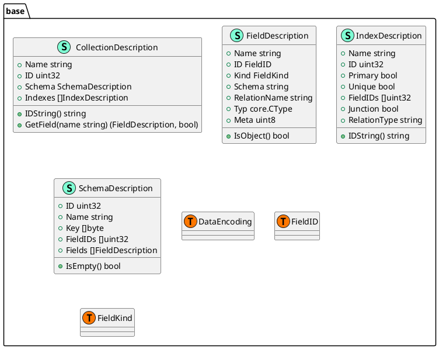


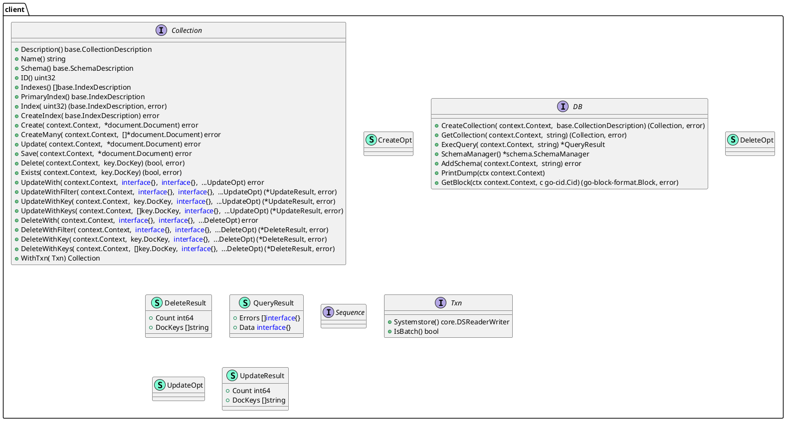

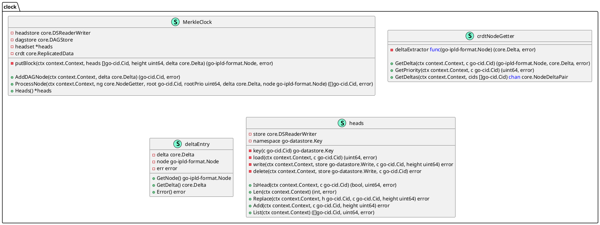


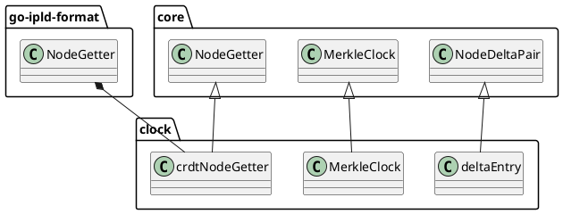


```plantuml
@startuml

namespace cmd {
    class BadgerOptions << (S,Aquamarine) >> {
        + Path string

    }
    class Config << (S,Aquamarine) >> {
        + Database Options

    }
    class MemoryOptions << (S,Aquamarine) >> {
        + Size uint64

    }
    class Options << (S,Aquamarine) >> {
        + Address string
        + Store string
        + Memory MemoryOptions
        + Badger BadgerOptions

    }
}




```plantuml
@startuml

"v3.Options" *-- "cmd.BadgerOptions"

@enduml
```


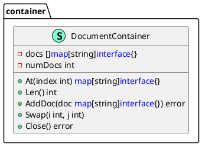


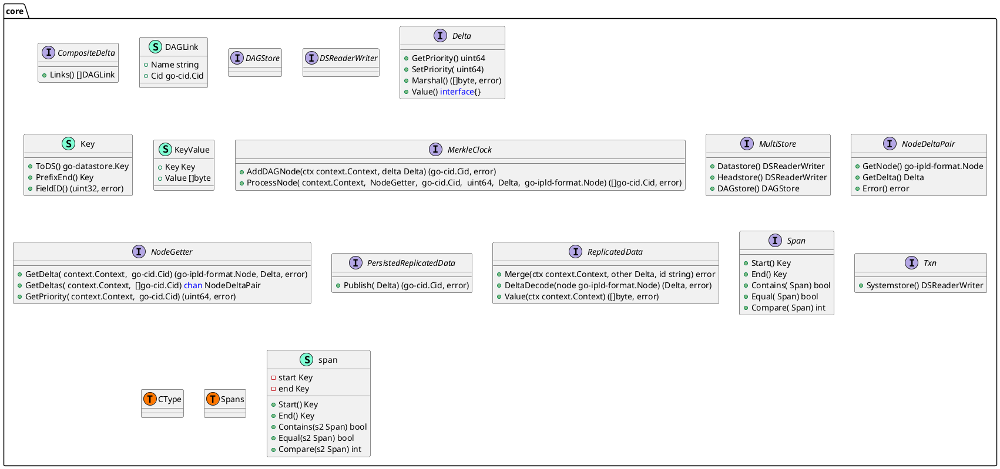


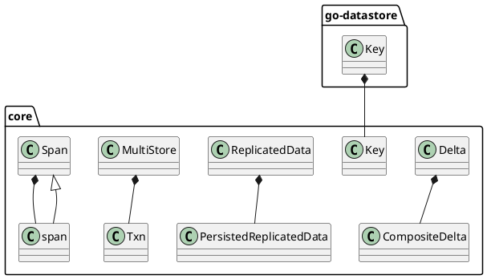


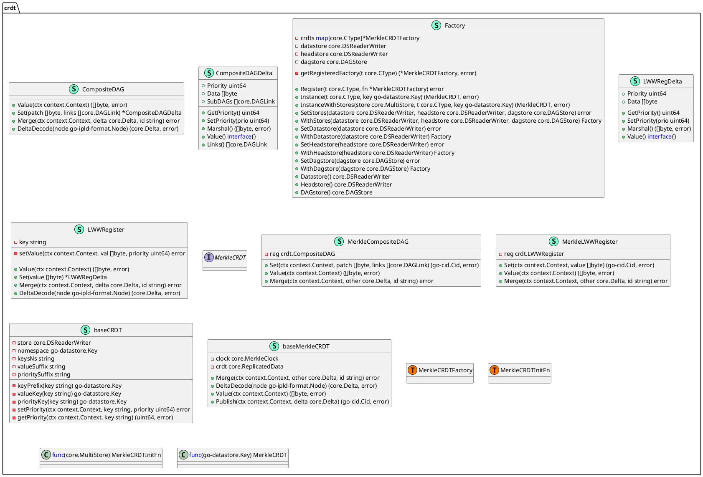


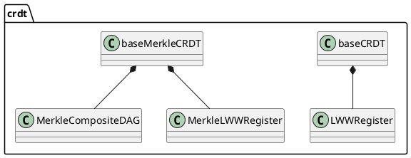


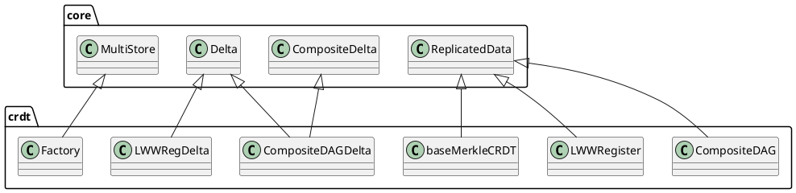


```plantuml
@startuml

namespace db {
    class Collection << (S,Aquamarine) >> {
        - db *DB
        - txn *Txn
        - colID uint32
        - colIDKey core.Key
        - desc base.CollectionDescription

        - create(ctx context.Context, txn *Txn, doc *document.Document) error
        - update(ctx context.Context, txn *Txn, doc *document.Document) error
        - save(ctx context.Context, txn *Txn, doc *document.Document) error
        - delete(ctx context.Context, txn *Txn, key key.DocKey) (bool, error)
        - exists(ctx context.Context, txn *Txn, key key.DocKey) (bool, error)
        - saveDocValue(ctx context.Context, txn *Txn, key go-datastore.Key, val document.Value) (go-cid.Cid, error)
        - saveValueToMerkleCRDT(ctx context.Context, txn *Txn, key go-datastore.Key, ctype core.CType, args ...<font color=blue>interface</font>{}) (go-cid.Cid, error)
        - getTxn(ctx context.Context, readonly bool) (*Txn, error)
        - discardImplicitTxn(ctx context.Context, txn *Txn) 
        - commitImplicitTxn(ctx context.Context, txn *Txn) error
        - getIndexDocKey(key go-datastore.Key, indexID uint32) go-datastore.Key
        - getPrimaryIndexDocKey(key go-datastore.Key) go-datastore.Key
        - getFieldKey(key go-datastore.Key, fieldName string) go-datastore.Key
        - getSchemaFieldID(fieldName string) uint32
        - deleteWithKey(ctx context.Context, txn *Txn, key key.DocKey, deleter <font color=blue>interface</font>{}, opts ...client.DeleteOpt) (*client.DeleteResult, error)
        - deleteWithKeys(ctx context.Context, txn *Txn, keys []key.DocKey, deleter <font color=blue>interface</font>{}, opts ...client.DeleteOpt) (*client.DeleteResult, error)
        - makeSelectionDeleteQuery(ctx context.Context, txn *Txn, filter <font color=blue>interface</font>{}, opts ...client.DeleteOpt) (planner.Query, error)
        - deleteWithFilter(ctx context.Context, txn *Txn, filter <font color=blue>interface</font>{}, deleter <font color=blue>interface</font>{}, opts ...client.DeleteOpt) (*client.DeleteResult, error)
        - makeSelectDeleteLocal(filter *parser.Filter) (*parser.Select, error)
        - get(ctx context.Context, txn *Txn, key key.DocKey) (*document.Document, error)
        - updateWithKey(ctx context.Context, txn *Txn, key key.DocKey, updater <font color=blue>interface</font>{}, opts ...client.UpdateOpt) (*client.UpdateResult, error)
        - updateWithKeys(ctx context.Context, txn *Txn, keys []key.DocKey, updater <font color=blue>interface</font>{}, opts ...client.UpdateOpt) (*client.UpdateResult, error)
        - updateWithFilter(ctx context.Context, txn *Txn, filter <font color=blue>interface</font>{}, updater <font color=blue>interface</font>{}, opts ...client.UpdateOpt) (*client.UpdateResult, error)
        - applyPatch(txn *Txn, doc <font color=blue>map</font>[string]<font color=blue>interface</font>{}, patch []<font color=blue>map</font>[string]<font color=blue>interface</font>{}) error
        - applyPatchOp(txn *Txn, dockey string, field string, currentVal <font color=blue>interface</font>{}, patchOp <font color=blue>map</font>[string]<font color=blue>interface</font>{}) error
        - applyMerge(ctx context.Context, txn *Txn, doc <font color=blue>map</font>[string]<font color=blue>interface</font>{}, merge <font color=blue>map</font>[string]<font color=blue>interface</font>{}) error
        - applyMergePatchOp(txn *Txn, docKey string, field string, currentVal <font color=blue>interface</font>{}, targetVal <font color=blue>interface</font>{}) error
        - makeSelectionUpdateQuery(ctx context.Context, txn *Txn, filter <font color=blue>interface</font>{}, opts ...client.UpdateOpt) (planner.Query, error)
        - makeSelectUpdateLocal(filter *parser.Filter) (*parser.Select, error)
        - getCollectionForPatchOpPath(txn *Txn, path string) (*Collection, bool, error)
        - getTargetKeyForPatchPath(txn *Txn, doc <font color=blue>map</font>[string]<font color=blue>interface</font>{}, path string) (string, error)

        + Description() base.CollectionDescription
        + Name() string
        + Schema() base.SchemaDescription
        + ID() uint32
        + Indexes() []base.IndexDescription
        + PrimaryIndex() base.IndexDescription
        + Index(id uint32) (base.IndexDescription, error)
        + CreateIndex(idesc base.IndexDescription) error
        + WithTxn(txn client.Txn) client.Collection
        + Create(ctx context.Context, doc *document.Document) error
        + CreateMany(ctx context.Context, docs []*document.Document) error
        + Update(ctx context.Context, doc *document.Document) error
        + Save(ctx context.Context, doc *document.Document) error
        + Delete(ctx context.Context, key key.DocKey) (bool, error)
        + Exists(ctx context.Context, key key.DocKey) (bool, error)
        + Delete2(doc *document.SimpleDocument, opts ...client.DeleteOpt) error
        + DeleteWith(ctx context.Context, target <font color=blue>interface</font>{}, deleter <font color=blue>interface</font>{}, opts ...client.DeleteOpt) error
        + DeleteWithFilter(ctx context.Context, filter <font color=blue>interface</font>{}, deleter <font color=blue>interface</font>{}, opts ...client.DeleteOpt) (*client.DeleteResult, error)
        + DeleteWithKey(ctx context.Context, key key.DocKey, deleter <font color=blue>interface</font>{}, opts ...client.DeleteOpt) (*client.DeleteResult, error)
        + DeleteWithKeys(ctx context.Context, keys []key.DocKey, deleter <font color=blue>interface</font>{}, opts ...client.DeleteOpt) (*client.DeleteResult, error)
        + DeleteWithDoc(doc *document.SimpleDocument, deleter <font color=blue>interface</font>{}, opts ...client.DeleteOpt) error
        + DeleteWithDocs(docs []*document.SimpleDocument, deleter <font color=blue>interface</font>{}, opts ...client.DeleteOpt) error
        + Get(ctx context.Context, key key.DocKey) (*document.Document, error)
        + Create2(doc *document.SimpleDocument, opts ...CreateOpt) error
        + Update2(doc *document.SimpleDocument, opts ...client.UpdateOpt) error
        + UpdateWith(ctx context.Context, target <font color=blue>interface</font>{}, updater <font color=blue>interface</font>{}, opts ...client.UpdateOpt) error
        + UpdateWithFilter(ctx context.Context, filter <font color=blue>interface</font>{}, updater <font color=blue>interface</font>{}, opts ...client.UpdateOpt) (*client.UpdateResult, error)
        + UpdateWithKey(ctx context.Context, key key.DocKey, updater <font color=blue>interface</font>{}, opts ...client.UpdateOpt) (*client.UpdateResult, error)
        + UpdateWithKeys(ctx context.Context, keys []key.DocKey, updater <font color=blue>interface</font>{}, opts ...client.UpdateOpt) (*client.UpdateResult, error)
        + UpdateWithDoc(doc *document.SimpleDocument, updater <font color=blue>interface</font>{}, opts ...client.UpdateOpt) error
        + UpdateWithDocs(docs []*document.SimpleDocument, updater <font color=blue>interface</font>{}, opts ...client.UpdateOpt) error

    }
    class CreateOpt << (S,Aquamarine) >> {
    }
    class DB << (S,Aquamarine) >> {
        - glock sync.RWMutex
        - rootstore go-datastore.Batching
        - systemstore core.DSReaderWriter
        - ssKeyTransform keytransform.KeyTransform
        - datastore core.DSReaderWriter
        - dsKeyTransform keytransform.KeyTransform
        - headstore core.DSReaderWriter
        - hsKeyTransform keytransform.KeyTransform
        - dagstore core.DAGStore
        - dagKeyTransform keytransform.KeyTransform
        - crdtFactory *crdt.Factory
        - schema *schema.SchemaManager
        - queryExecutor *planner.QueryExecutor
        - initialized bool
        - log v2.StandardLogger
        - options <font color=blue>interface</font>{}

        - newCollection(desc base.CollectionDescription) (*Collection, error)
        - printDebugDB(ctx context.Context) 
        - loadSchema(ctx context.Context) error
        - saveSchema(ctx context.Context, astdoc *ast.Document) error
        - getSequence(ctx context.Context, key string) (*sequence, error)
        - newTxn(ctx context.Context, readonly bool) (*Txn, error)

        + Listen(address string) 
        + GetBlock(ctx context.Context, c go-cid.Cid) (go-block-format.Block, error)
        + CreateCollection(ctx context.Context, desc base.CollectionDescription) (client.Collection, error)
        + GetCollection(ctx context.Context, name string) (client.Collection, error)
        + Start(ctx context.Context) error
        + Initialize(ctx context.Context) error
        + PrintDump(ctx context.Context) 
        + Close() 
        + ExecQuery(ctx context.Context, query string) *client.QueryResult
        + ExecIntrospection(query string) *client.QueryResult
        + AddSchema(ctx context.Context, schema string) error
        + SchemaManager() *schema.SchemaManager
        + NewTxn(ctx context.Context, readonly bool) (*Txn, error)

    }
    class DeleteOpt << (S,Aquamarine) >> {
    }
    class DeleteResult << (S,Aquamarine) >> {
        + Count int64
        + DocKeys []string

    }
    class Txn << (S,Aquamarine) >> {
        - systemstore core.DSReaderWriter
        - datastore core.DSReaderWriter
        - headstore core.DSReaderWriter
        - dagstore core.DAGStore

        + Systemstore() core.DSReaderWriter
        + Datastore() core.DSReaderWriter
        + Headstore() core.DSReaderWriter
        + DAGstore() core.DAGStore
        + IsBatch() bool

    }
    class UpdateOpt << (S,Aquamarine) >> {
    }
    interface patcher  {
    }
    class sequence << (S,Aquamarine) >> {
        - db *DB
        - key go-datastore.Key
        - val uint64

        - get(ctx context.Context) (uint64, error)
        - update(ctx context.Context) error
        - next(ctx context.Context) (uint64, error)

    }
    class shimBatcherTxn << (S,Aquamarine) >> {
        + Discard(_ context.Context) 

    }
    class shimTxnStore << (S,Aquamarine) >> {
        + Sync(ctx context.Context, prefix go-datastore.Key) error
        + Close() error

    }
}

@enduml
```


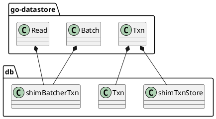


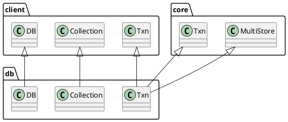


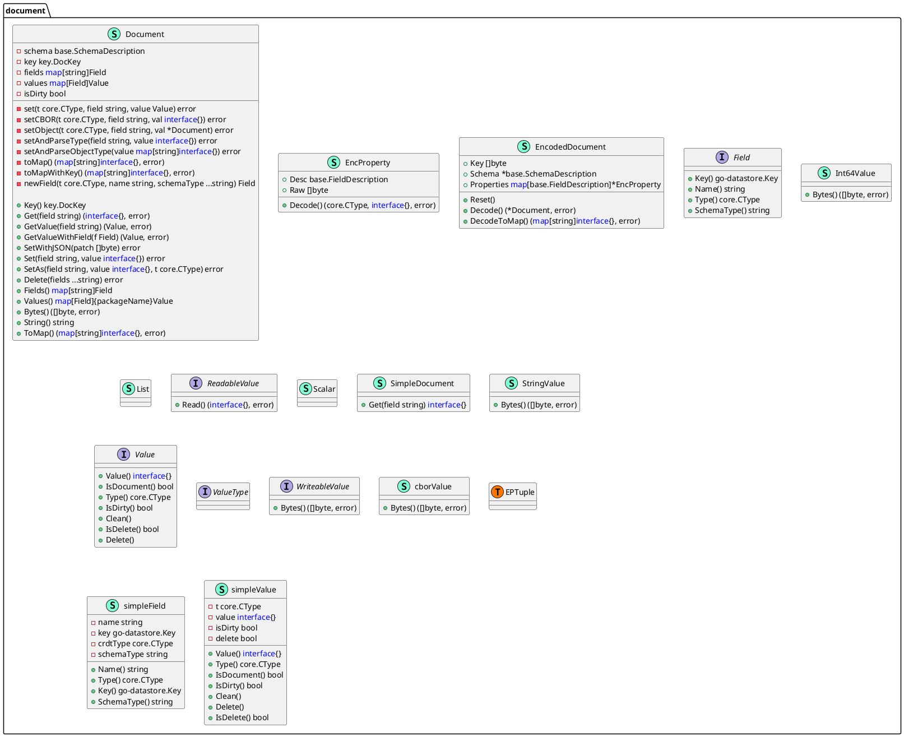


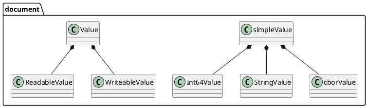


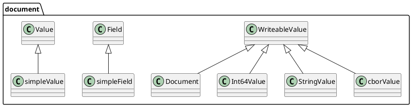


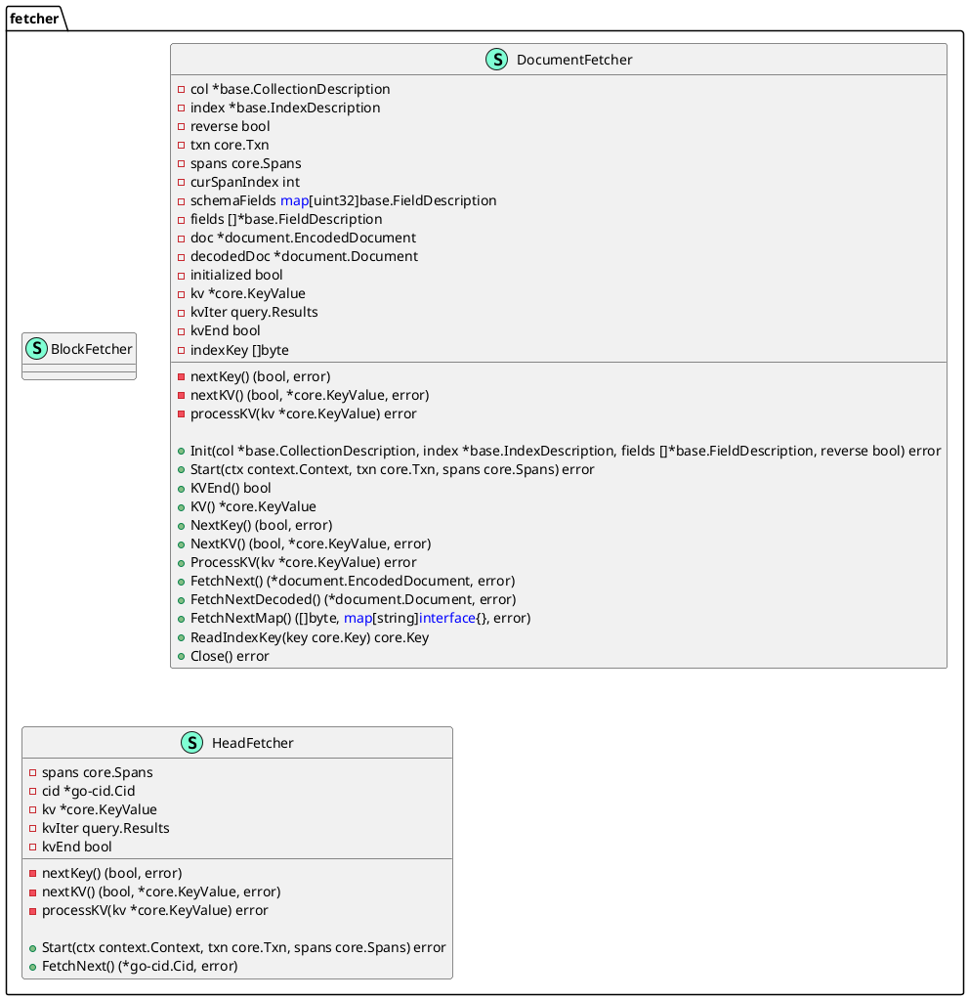


```plantuml
@startuml

namespace http {
    class Server << (S,Aquamarine) >> {
        - db client.DB
        - router *chi.Mux

        - ping(w http.ResponseWriter, r *http.Request) 
        - dump(w http.ResponseWriter, r *http.Request) 
        - execGQL(w http.ResponseWriter, r *http.Request) 
        - loadSchema(w http.ResponseWriter, r *http.Request) 
        - getBlock(w http.ResponseWriter, r *http.Request) 

        + Listen(addr string) 

    }
}

@enduml
```


```plantuml
@startuml

namespace key {
    class DocKey << (S,Aquamarine) >> {
        - version uint16
        - uuid go.uuid.UUID
        - cid go-cid.Cid
        - peerID string

        - subrec(subparts []string) DocKey

        + UUID() go.uuid.UUID
        + String() string
        + Bytes() []byte
        + Verify(ctx context.Context, data go-cid.Cid, peerID string) bool
        + Sub(subname string) DocKey

    }
}

@enduml
```


```plantuml
@startuml

"go-datastore.Key" *-- "key.DocKey"

@enduml
```


```plantuml
@startuml

namespace parser {
    class CommitSelect << (S,Aquamarine) >> {
        + Alias string
        + Name string
        + Type CommitType
        + DocKey string
        + FieldName string
        + Cid string
        + Limit *Limit
        + OrderBy *OrderBy
        + Fields []Selection
        + Statement *ast.Field

        + GetRoot() SelectionType
        + GetStatement() ast.Node
        + GetName() string
        + GetAlias() string
        + GetSelections() []Selection
        + ToSelect() *Select

    }
    class EvalContext << (S,Aquamarine) >> {
    }
    class Field << (S,Aquamarine) >> {
        + Name string
        + Alias string
        + Root SelectionType
        + Statement *ast.Field

        + GetRoot() SelectionType
        + GetSelections() []Selection
        + GetName() string
        + GetAlias() string
        + GetStatement() ast.Node

    }
    class Filter << (S,Aquamarine) >> {
        + Conditions <font color=blue>map</font>[string]<font color=blue>interface</font>{}
        + Statement *ast.ObjectValue

    }
    class GroupBy << (S,Aquamarine) >> {
        + Fields []string

    }
    class Limit << (S,Aquamarine) >> {
        + Limit int64
        + Offset int64

    }
    class Mutation << (S,Aquamarine) >> {
        + Name string
        + Alias string
        + Type MutationType
        + Schema string
        + IDs []string
        + Filter *Filter
        + Data string
        + Fields []Selection
        + Statement *ast.Field

        + GetRoot() SelectionType
        + GetStatement() ast.Node
        + GetSelections() []Selection
        + GetName() string
        + GetAlias() string
        + ToSelect() *Select

    }
    class ObjectPayload << (S,Aquamarine) >> {
        + Object <font color=blue>map</font>[string]<font color=blue>interface</font>{}
        + Array []<font color=blue>interface</font>{}

    }
    class OperationDefinition << (S,Aquamarine) >> {
        + Name string
        + Selections []Selection
        + Statement *ast.OperationDefinition

        + GetStatement() ast.Node

    }
    class OrderBy << (S,Aquamarine) >> {
        + Conditions []SortCondition
        + Statement *ast.ObjectValue

    }
    class Query << (S,Aquamarine) >> {
        + Queries []*OperationDefinition
        + Mutations []*OperationDefinition
        + Statement *ast.Document

        + GetStatement() ast.Node

    }
    class Select << (S,Aquamarine) >> {
        + Name string
        + Alias string
        + CollectionName string
        + Root SelectionType
        + DocKey string
        + CID string
        + Filter *Filter
        + Limit *Limit
        + OrderBy *OrderBy
        + GroupBy *GroupBy
        + Fields []Selection
        + Statement *ast.Field

        + GetRoot() SelectionType
        + GetStatement() ast.Node
        + GetSelections() []Selection
        + GetName() string
        + GetAlias() string

    }
    interface Selection  {
        + GetName() string
        + GetAlias() string
        + GetSelections() []Selection
        + GetRoot() SelectionType

    }
    class SortCondition << (S,Aquamarine) >> {
        + Field string
        + Direction SortDirection

    }
    interface Statement  {
        + GetStatement() ast.Node

    }
    class parser.CommitType << (T, #FF7700) >>  {
    }
    class parser.MutationType << (T, #FF7700) >>  {
    }
    class parser.SelectionType << (T, #FF7700) >>  {
    }
    class parser.SortDirection << (T, #FF7700) >>  {
    }
    class parser.parseFn << (T, #FF7700) >>  {
    }
    class "<font color=blue>func</font>(*ast.ObjectValue) (<font color=blue>interface</font>{}, error)" as fontcolorbluefuncfontastObjectValuefontcolorblueinterfacefonterror {
        'This class was created so that we can correctly have an alias pointing to this name. Since it contains dots that can break namespaces
    }
}

@enduml
```


```plantuml
@startuml

"context.Context" *-- "parser.EvalContext"
"parser.Statement" *-- "parser.Selection"

@enduml
```


```plantuml
@startuml

"parser.Selection" <|-- "parser.CommitSelect"
"parser.Statement" <|-- "parser.CommitSelect"
"parser.Selection" <|-- "parser.Field"
"parser.Statement" <|-- "parser.Field"
"parser.Selection" <|-- "parser.Mutation"
"parser.Statement" <|-- "parser.Mutation"
"parser.Statement" <|-- "parser.OperationDefinition"
"parser.Statement" <|-- "parser.Query"
"parser.Selection" <|-- "parser.Select"
"parser.Statement" <|-- "parser.Select"

@enduml
```


```plantuml
@startuml

namespace planner {
    class ExecutionContext << (S,Aquamarine) >> {
    }
    interface MultiNode  {
        + Children() []planNode
        + AddChild( string,  planNode) error
        + ReplaceChildAt( int,  string,  planNode) error
        + SetMultiScanner( *multiScanNode) 

    }
    class PlanContext << (S,Aquamarine) >> {
    }
    class Planner << (S,Aquamarine) >> {
        - txn client.Txn
        - db client.DB
        - ctx context.Context
        - evalCtx parser.EvalContext

        - commitSelectLatest(parsed *parser.CommitSelect) (*commitSelectNode, error)
        - commitSelectBlock(parsed *parser.CommitSelect) (*commitSelectNode, error)
        - commitSelectAll(parsed *parser.CommitSelect) (*commitSelectNode, error)
        - getSource(collection string) (planSource, error)
        - getCollectionScanPlan(collection string) (planSource, error)
        - getCollectionDesc(name string) (base.CollectionDescription, error)
        - newPlan(stmt parser.Statement) (planNode, error)
        - newObjectMutationPlan(stmt *parser.Mutation) (planNode, error)
        - makePlan(stmt parser.Statement) (planNode, error)
        - optimizePlan(plan planNode) error
        - expandPlan(plan planNode) error
        - expandSelectTopNodePlan(plan *selectTopNode) error
        - expandMultiNode(plan MultiNode) error
        - expandTypeIndexJoinPlan(plan *typeIndexJoin) error
        - expandGroupNodePlan(plan *selectTopNode) error
        - walkAndReplacePlan(plan planNode, target planNode, replace planNode) error
        - walkAndFindPlanType(plan planNode, target planNode) planNode
        - queryDocs(query *parser.Query) ([]<font color=blue>map</font>[string]<font color=blue>interface</font>{}, error)
        - query(query *parser.Query) (planNode, error)
        - render(parsed *parser.Select) *renderNode
        - makeTypeIndexJoin(parent *selectNode, source planNode, subType *parser.Select) (*typeIndexJoin, error)
        - makeTypeJoinOne(parent *selectNode, source planNode, subType *parser.Select) (*typeJoinOne, error)
        - makeTypeJoinMany(parent *selectNode, source planNode, subType *parser.Select) (*typeJoinMany, error)
        - newContainerValuesNode(ordering []parser.SortCondition) *valuesNode

        + CommitSelect(parsed *parser.CommitSelect) (planNode, error)
        + CreateDoc(parsed *parser.Mutation) (planNode, error)
        + HeadScan() *headsetScanNode
        + DAGScan() *dagScanNode
        + DeleteDocs(parsed *parser.Mutation) (planNode, error)
        + GroupBy(n *parser.GroupBy, childSelect *parser.Select) (*groupNode, error)
        + Limit(n *parser.Limit) (*limitNode, error)
        + Scan() *scanNode
        + SubSelect(parsed *parser.Select) (planNode, error)
        + SelectFromSource(parsed *parser.Select, source planNode, fromCollection bool, providedSourceInfo *sourceInfo) (planNode, error)
        + Select(parsed *parser.Select) (planNode, error)
        + OrderBy(n *parser.OrderBy) (*sortNode, error)
        + UpdateDocs(parsed *parser.Mutation) (planNode, error)

    }
    class QueryExecutor << (S,Aquamarine) >> {
        + SchemaManager *schema.SchemaManager

        - parseQueryString(query string) (*parser.Query, error)

        + MakeSelectQuery(ctx context.Context, db client.DB, txn client.Txn, selectStmt *parser.Select) (Query, error)
        + ExecQuery(ctx context.Context, db client.DB, txn client.Txn, query string, args ...<font color=blue>interface</font>{}) ([]<font color=blue>map</font>[string]<font color=blue>interface</font>{}, error)

    }
    class Statement << (S,Aquamarine) >> {
    }
    class allSortStrategy << (S,Aquamarine) >> {
        - valueNode *valuesNode

        + Add(doc <font color=blue>map</font>[string]<font color=blue>interface</font>{}) error
        + Finish() 
        + Next() (bool, error)
        + Values() <font color=blue>map</font>[string]<font color=blue>interface</font>{}
        + Close() 

    }
    interface appendNode  {
        + Append() bool

    }
    class baseNode << (S,Aquamarine) >> {
        - plan planNode

        + Init() error
        + Start() error
        + Next() (bool, error)
        + Spans(spans core.Spans) 
        + Values() <font color=blue>map</font>[string]<font color=blue>interface</font>{}
        + Close() error
        + Source() planNode

    }
    class commitSelectNode << (S,Aquamarine) >> {
        - p *Planner
        - source *dagScanNode
        - subRenderInfo <font color=blue>map</font>[string]renderInfo
        - doc <font color=blue>map</font>[string]<font color=blue>interface</font>{}

        + Init() error
        + Start() error
        + Next() (bool, error)
        + Values() <font color=blue>map</font>[string]<font color=blue>interface</font>{}
        + Spans(spans core.Spans) 
        + Close() error
        + Source() planNode

    }
    class commitSelectTopNode << (S,Aquamarine) >> {
        - p *Planner
        - plan planNode

        + Init() error
        + Start() error
        + Next() (bool, error)
        + Spans(spans core.Spans) 
        + Values() <font color=blue>map</font>[string]<font color=blue>interface</font>{}
        + Source() planNode
        + Close() error
        + Append() bool

    }
    class createNode << (S,Aquamarine) >> {
        - p *Planner
        - collection client.Collection
        - newDocStr string
        - doc *document.Document
        - err error
        - returned bool

        + Init() error
        + Start() error
        + Next() (bool, error)
        + Spans(spans core.Spans) 
        + Values() <font color=blue>map</font>[string]<font color=blue>interface</font>{}
        + Close() error
        + Source() planNode

    }
    class dagScanNode << (S,Aquamarine) >> {
        - p *Planner
        - cid *go-cid.Cid
        - field string
        - depthLimit uint32
        - depthVisited uint32
        - visitedNodes <font color=blue>map</font>[string]bool
        - queuedCids *list.List
        - headset *headsetScanNode
        - doc <font color=blue>map</font>[string]<font color=blue>interface</font>{}

        + Init() error
        + Start() error
        + Spans(spans core.Spans) 
        + Close() error
        + Source() planNode
        + Next() (bool, error)
        + Values() <font color=blue>map</font>[string]<font color=blue>interface</font>{}

    }
    class dataSource << (S,Aquamarine) >> {
        - pipeNode *pipeNode
        - parentSource planNode
        - childSource planNode
        - childName string
        - lastParentDocIndex int
        - lastChildDocIndex int

        - mergeParent(keyFields []string, destination *orderedMap) (<font color=blue>map</font>[string]<font color=blue>interface</font>{}, bool, error)
        - appendChild(keyFields []string, valuesByKey *orderedMap) (<font color=blue>map</font>[string]<font color=blue>interface</font>{}, bool, error)

        + Init() error
        + Start() error
        + Spans(spans core.Spans) 
        + Close() error
        + Source() planNode

    }
    class deleteNode << (S,Aquamarine) >> {
        - p *Planner
        - collection client.Collection
        - filter *parser.Filter
        - ids []string
        - patch string
        - isUpdating bool
        - deleteIter *valuesNode
        - results planNode

        + Next() (bool, error)
        + Values() <font color=blue>map</font>[string]<font color=blue>interface</font>{}
        + Spans(spans core.Spans) 
        + Init() error
        + Start() error
        + Close() error
        + Source() planNode

    }
    class groupNode << (S,Aquamarine) >> {
        - p *Planner
        - childSelect *parser.Select
        - groupByFields []string
        - dataSource dataSource
        - values []<font color=blue>map</font>[string]<font color=blue>interface</font>{}
        - currentIndex int
        - currentValue <font color=blue>map</font>[string]<font color=blue>interface</font>{}

        + Init() error
        + Start() error
        + Spans(spans core.Spans) 
        + Close() error
        + Source() planNode
        + Values() <font color=blue>map</font>[string]<font color=blue>interface</font>{}
        + Next() (bool, error)

    }
    class headsetScanNode << (S,Aquamarine) >> {
        - p *Planner
        - key core.Key
        - spans core.Spans
        - scanInitialized bool
        - cid *go-cid.Cid
        - fetcher fetcher.HeadFetcher

        - initScan() error

        + Init() error
        + Spans(spans core.Spans) 
        + Start() error
        + Next() (bool, error)
        + Values() <font color=blue>map</font>[string]<font color=blue>interface</font>{}
        + Close() error
        + Source() planNode

    }
    class limitNode << (S,Aquamarine) >> {
        - p *Planner
        - plan planNode
        - limit int64
        - offset int64
        - rowIndex int64

        + Init() error
        + Start() error
        + Spans(spans core.Spans) 
        + Close() error
        + Values() <font color=blue>map</font>[string]<font color=blue>interface</font>{}
        + Next() (bool, error)
        + Source() planNode

    }
    interface mergeNode  {
        + Merge() bool

    }
    class multiScanNode << (S,Aquamarine) >> {
        - numReaders int
        - numCalls int
        - lastBool bool
        - lastErr error

        - addReader() 

        + Source() planNode
        + Next() (bool, error)

    }
    class orderedMap << (S,Aquamarine) >> {
        - values []<font color=blue>map</font>[string]<font color=blue>interface</font>{}
        - indexesByKey <font color=blue>map</font>[string]int

        - mergeParent(key string, childAddress string, value <font color=blue>map</font>[string]<font color=blue>interface</font>{}) 
        - appendChild(key string, childAddress string, value <font color=blue>map</font>[string]<font color=blue>interface</font>{}) 

    }
    class parallelNode << (S,Aquamarine) >> {
        - p *Planner
        - children []planNode
        - childFields []string
        - multiscan *multiScanNode
        - doc <font color=blue>map</font>[string]<font color=blue>interface</font>{}

        - applyToPlans(fn <font color=blue>func</font>(planNode) error) error
        - nextMerge(index int, plan mergeNode) (bool, error)
        - nextAppend(index int, plan appendNode) (bool, error)

        + Init() error
        + Start() error
        + Spans(spans core.Spans) 
        + Close() error
        + Next() (bool, error)
        + Values() <font color=blue>map</font>[string]<font color=blue>interface</font>{}
        + Source() planNode
        + Children() []planNode
        + AddChild(field string, node planNode) error
        + ReplaceChildAt(i int, field string, node planNode) error
        + SetMultiScanner(ms *multiScanNode) 

    }
    class pipeNode << (S,Aquamarine) >> {
        - source planNode
        - docs *container.DocumentContainer
        - docIndex int

        + Init() error
        + Start() error
        + Spans(spans core.Spans) 
        + Close() error
        + Source() planNode
        + Values() <font color=blue>map</font>[string]<font color=blue>interface</font>{}
        + Next() (bool, error)

    }
    interface planNode  {
        + Init() error
        + Start() error
        + Next() (bool, error)
        + Spans( core.Spans) 
        + Values() <font color=blue>map</font>[string]<font color=blue>interface</font>{}
        + Source() planNode
        + Close() error

    }
    class planSource << (S,Aquamarine) >> {
        - info sourceInfo
        - plan planNode

    }
    class planner.Query << (T, #FF7700) >>  {
    }
    class renderInfo << (S,Aquamarine) >> {
        - sourceFieldName string
        - destinationFieldName string
        - children []renderInfo

        - render(src <font color=blue>map</font>[string]<font color=blue>interface</font>{}, destination <font color=blue>map</font>[string]<font color=blue>interface</font>{}) 

    }
    class renderNode << (S,Aquamarine) >> {
        - p *Planner
        - plan planNode
        - renderInfo topLevelRenderInfo

        + Init() error
        + Start() error
        + Next() (bool, error)
        + Spans(spans core.Spans) 
        + Close() error
        + Source() planNode
        + Values() <font color=blue>map</font>[string]<font color=blue>interface</font>{}

    }
    class scanNode << (S,Aquamarine) >> {
        - p *Planner
        - desc base.CollectionDescription
        - index *base.IndexDescription
        - fields []*base.FieldDescription
        - doc <font color=blue>map</font>[string]<font color=blue>interface</font>{}
        - docKey []byte
        - spans core.Spans
        - reverse bool
        - filter *parser.Filter
        - scanInitialized bool
        - fetcher fetcher.DocumentFetcher

        - initCollection(desc base.CollectionDescription) error
        - initScan() error

        + Init() error
        + Start() error
        + Next() (bool, error)
        + Spans(spans core.Spans) 
        + Values() <font color=blue>map</font>[string]<font color=blue>interface</font>{}
        + Close() error
        + Source() planNode
        + Merge() bool

    }
    class selectNode << (S,Aquamarine) >> {
        - p *Planner
        - source planNode
        - origSource planNode
        - sourceInfo sourceInfo
        - renderInfo *renderInfo
        - doc <font color=blue>map</font>[string]<font color=blue>interface</font>{}
        - filter *parser.Filter
        - groupSelect *parser.Select

        - addSubPlan(field string, plan planNode) error
        - initSource(parsed *parser.Select) error
        - initFields(parsed *parser.Select) error

        + Init() error
        + Start() error
        + Next() (bool, error)
        + Spans(spans core.Spans) 
        + Values() <font color=blue>map</font>[string]<font color=blue>interface</font>{}
        + Close() error
        + Source() planNode

    }
    class selectTopNode << (S,Aquamarine) >> {
        - source planNode
        - group *groupNode
        - sort *sortNode
        - limit *limitNode
        - render *renderNode
        - plan planNode

        + Init() error
        + Start() error
        + Next() (bool, error)
        + Spans(spans core.Spans) 
        + Values() <font color=blue>map</font>[string]<font color=blue>interface</font>{}
        + Source() planNode
        + Close() error

    }
    class sortNode << (S,Aquamarine) >> {
        - p *Planner
        - plan planNode
        - ordering []parser.SortCondition
        - valueIter valueIterator
        - sortStrategy sortingStrategy
        - needSort bool

        + Init() error
        + Start() error
        + Spans(spans core.Spans) 
        + Values() <font color=blue>map</font>[string]<font color=blue>interface</font>{}
        + Next() (bool, error)
        + Close() error
        + Source() planNode

    }
    interface sortingStrategy  {
        + Add( <font color=blue>map</font>[string]<font color=blue>interface</font>{}) error
        + Finish() 

    }
    class sourceInfo << (S,Aquamarine) >> {
        - collectionDescription base.CollectionDescription

    }
    class topLevelRenderInfo << (S,Aquamarine) >> {
        - children []renderInfo

    }
    class typeIndexJoin << (S,Aquamarine) >> {
        - p *Planner
        - joinPlan planNode

        + Init() error
        + Start() error
        + Spans(spans core.Spans) 
        + Next() (bool, error)
        + Values() <font color=blue>map</font>[string]<font color=blue>interface</font>{}
        + Close() error
        + Source() planNode
        + Merge() bool

    }
    class typeJoinMany << (S,Aquamarine) >> {
        - p *Planner
        - root planNode
        - rootName string
        - index *scanNode
        - subType planNode
        - subTypeName string

        + Init() error
        + Start() error
        + Spans(spans core.Spans) 
        + Next() (bool, error)
        + Values() <font color=blue>map</font>[string]<font color=blue>interface</font>{}
        + Close() error
        + Source() planNode

    }
    class typeJoinOne << (S,Aquamarine) >> {
        - p *Planner
        - root planNode
        - subType planNode
        - rootName string
        - subTypeName string
        - subTypeFieldName string
        - primary bool
        - spans core.Spans

        - valuesSecondary(doc <font color=blue>map</font>[string]<font color=blue>interface</font>{}) <font color=blue>map</font>[string]<font color=blue>interface</font>{}
        - valuesPrimary(doc <font color=blue>map</font>[string]<font color=blue>interface</font>{}) <font color=blue>map</font>[string]<font color=blue>interface</font>{}

        + Init() error
        + Start() error
        + Spans(spans core.Spans) 
        + Next() (bool, error)
        + Values() <font color=blue>map</font>[string]<font color=blue>interface</font>{}
        + Close() error
        + Source() planNode

    }
    class updateNode << (S,Aquamarine) >> {
        - p *Planner
        - collection client.Collection
        - filter *parser.Filter
        - ids []string
        - patch string
        - isUpdating bool
        - updateIter *valuesNode
        - results planNode

        + Next() (bool, error)
        + Values() <font color=blue>map</font>[string]<font color=blue>interface</font>{}
        + Spans(spans core.Spans) 
        + Init() error
        + Start() error
        + Close() error
        + Source() planNode

    }
    interface valueIterator  {
        + Next() (bool, error)
        + Values() <font color=blue>map</font>[string]<font color=blue>interface</font>{}
        + Close() 

    }
    class valuesNode << (S,Aquamarine) >> {
        - p *Planner
        - ordering []parser.SortCondition
        - docs *container.DocumentContainer
        - docIndex int

        - docValueLess(da <font color=blue>map</font>[string]<font color=blue>interface</font>{}, db <font color=blue>map</font>[string]<font color=blue>interface</font>{}) bool

        + Init() error
        + Start() error
        + Spans(spans core.Spans) 
        + Close() 
        + Next() (bool, error)
        + Values() <font color=blue>map</font>[string]<font color=blue>interface</font>{}
        + Source() planNode
        + SortAll() 
        + Less(i int, j int) bool
        + Swap(i int, j int) 
        + Len() int

    }
}

@enduml
```


```plantuml
@startuml

"context.Context" *-- "planner.ExecutionContext"
"planner.planNode" *-- "planner.MultiNode"
"context.Context" *-- "planner.PlanContext"
"planner.planNode" *-- "planner.appendNode"
"planner.planNode" *-- "planner.mergeNode"
"planner.scanNode" *-- "planner.multiScanNode"
"planner.valueIterator" *-- "planner.sortingStrategy"

@enduml
```


```plantuml
@startuml

"planner.sortingStrategy" <|-- "planner.allSortStrategy"
"planner.valueIterator" <|-- "planner.allSortStrategy"
"planner.planNode" <|-- "planner.baseNode"
"planner.planNode" <|-- "planner.commitSelectNode"
"planner.appendNode" <|-- "planner.commitSelectTopNode"
"planner.planNode" <|-- "planner.commitSelectTopNode"
"planner.planNode" <|-- "planner.createNode"
"planner.planNode" <|-- "planner.dagScanNode"
"planner.planNode" <|-- "planner.deleteNode"
"planner.planNode" <|-- "planner.groupNode"
"planner.planNode" <|-- "planner.headsetScanNode"
"planner.planNode" <|-- "planner.limitNode"
"planner.MultiNode" <|-- "planner.parallelNode"
"planner.planNode" <|-- "planner.parallelNode"
"planner.planNode" <|-- "planner.pipeNode"
"planner.planNode" <|-- "planner.renderNode"
"planner.mergeNode" <|-- "planner.scanNode"
"planner.planNode" <|-- "planner.scanNode"
"planner.planNode" <|-- "planner.selectNode"
"planner.planNode" <|-- "planner.selectTopNode"
"planner.planNode" <|-- "planner.sortNode"
"planner.mergeNode" <|-- "planner.typeIndexJoin"
"planner.planNode" <|-- "planner.typeIndexJoin"
"planner.planNode" <|-- "planner.typeJoinMany"
"planner.planNode" <|-- "planner.typeJoinOne"
"planner.planNode" <|-- "planner.updateNode"
"planner.valueIterator" <|-- "planner.valuesNode"

@enduml
```


```plantuml
@startuml

namespace schema {
    class Generator << (S,Aquamarine) >> {
        - typeDefs []*graphql.Object
        - manager *SchemaManager
        - expandedFields <font color=blue>map</font>[string]bool

        - expandInputArgument(obj *graphql.Object) error
        - createExpandedFieldSingle(f *graphql.FieldDefinition, t *graphql.Object) (*graphql.Field, error)
        - createExpandedFieldList(f *graphql.FieldDefinition, t *graphql.Object) (*graphql.Field, error)
        - buildTypesFromAST(document *ast.Document) ([]*graphql.Object, error)
        - genTypeMutationFields(obj *graphql.Object, filterInput *graphql.InputObject) ([]*graphql.Field, error)
        - genTypeMutationCreateField(obj *graphql.Object) (*graphql.Field, error)
        - genTypeMutationUpdateField(obj *graphql.Object, filter *graphql.InputObject) (*graphql.Field, error)
        - genTypeMutationDeleteField(obj *graphql.Object, filter *graphql.InputObject) (*graphql.Field, error)
        - genTypeFieldsEnum(obj *graphql.Object) *graphql.Enum
        - genTypeFilterArgInput(obj *graphql.Object) *graphql.InputObject
        - genTypeFilterBaseArgInput(obj *graphql.Object) *graphql.InputObject
        - genTypeHavingArgInput(obj *graphql.Object) *graphql.InputObject
        - genTypeHavingBlockInput(obj *graphql.Object) *graphql.InputObject
        - genTypeOrderArgInput(obj *graphql.Object) *graphql.InputObject
        - genTypeQueryableFieldList(obj *graphql.Object, config queryInputTypeConfig) *graphql.Field

        + CreateDescriptions(types []*graphql.Object) ([]base.CollectionDescription, error)
        + FromSDL(schema string) ([]*graphql.Object, *ast.Document, error)
        + FromAST(document *ast.Document) ([]*graphql.Object, error)
        + GenerateQueryInputForGQLType(obj *graphql.Object) (*graphql.Field, error)
        + GenerateMutationInputForGQLType(obj *graphql.Object) ([]*graphql.Field, error)
        + Reset() 

    }
    class Relation << (S,Aquamarine) >> {
        - name string
        - relType uint8
        - types []uint8
        - schemaTypes []string
        - fields []string
        - finalized bool

        - finalize() error
        - schemaTypeExists(t string) (int, bool)

        + Kind() uint8
        + Valid() bool
        + SchemaTypeIsPrimary(t string) bool
        + SchemaTypeIsOne(t string) bool
        + SchemaTypeIsMany(t string) bool
        + GetField(field string) (string, uint8, bool)
        + GetFieldFromSchemaType(schemaType string) (string, uint8, bool)

    }
    class RelationManager << (S,Aquamarine) >> {
        - relations <font color=blue>map</font>[string]*Relation

        - validate() ([]*Relation, bool)
        - register(rel *Relation) (bool, error)

        + GetRelations() 
        + GetRelation(name string) (*Relation, error)
        + GetRelationByDescription(field string, schemaType string, objectType string) *Relation
        + NumRelations() int
        + Exists(name string) bool
        + RegisterSingle(name string, schemaType string, schemaField string, relType uint8) (bool, error)
        + RegisterOneToOne(name string, primaryType string, primaryField string, secondaryType string, secondaryField string) (bool, error)
        + RegisterOneToMany(name string, oneType string, oneField string, manyType string, manyField string) (bool, error)
        + RegisterManyToMany(name string, type1 string, type2 string) (bool, error)

    }
    class SchemaManager << (S,Aquamarine) >> {
        - schema graphql.Schema

        + Generator *Generator
        + Relations *RelationManager

        + NewGenerator() *Generator
        + Schema() *graphql.Schema
        + ResolveTypes() error

    }
    class Type << (S,Aquamarine) >> {
        + Object *graphql.Object

    }
    class queryInputTypeConfig << (S,Aquamarine) >> {
        - filter *graphql.InputObject
        - groupBy *graphql.Enum
        - having *graphql.InputObject
        - order *graphql.InputObject

    }
}

@enduml
```


```plantuml
@startuml

"graphql.ObjectConfig" *-- "schema.Type"

@enduml
```


```plantuml
@startuml

namespace store {
    class bstore << (S,Aquamarine) >> {
        - store core.DSReaderWriter
        - rehash bool

        + HashOnRead(_ context.Context, enabled bool) 
        + Get(ctx context.Context, k go-cid.Cid) (go-block-format.Block, error)
        + Put(ctx context.Context, block go-block-format.Block) error
        + PutMany(ctx context.Context, blocks []go-block-format.Block) error
        + Has(ctx context.Context, k go-cid.Cid) (bool, error)
        + GetSize(ctx context.Context, k go-cid.Cid) (int, error)
        + DeleteBlock(ctx context.Context, k go-cid.Cid) error
        + AllKeysChan(ctx context.Context) (<font color=blue>chan</font> go-cid.Cid, error)

    }
    class dagStore << (S,Aquamarine) >> {
        - store core.DSReaderWriter

    }
}

@enduml
```


```plantuml
@startuml

"go-ipfs-blockstore.Blockstore" *-- "store.dagStore"

@enduml
```


```plantuml
@startuml

namespace tests_test {
    class QueryTestCase << (S,Aquamarine) >> {
        + Description string
        + Query string
        + Docs <font color=blue>map</font>[int][]string
        + Updates <font color=blue>map</font>[int][]string
        + Results []<font color=blue>map</font>[string]<font color=blue>interface</font>{}

    }
}

@enduml
```


```plantuml
@startuml

namespace utils {
    class ProxyStore << (S,Aquamarine) >> {
        - frontend go-datastore.Datastore
        - backends []go-datastore.Datastore

        + Get(ctx context.Context, key datastore.Key) ([]byte, error)
        + Has(ctx context.Context, key datastore.Key) (bool, error)
        + GetSize(ctx context.Context, key datastore.Key) (int, error)
        + Query(ctx context.Context, q query.Query) (query.Results, error)
        + Put(ctx context.Context, key datastore.Key, value []byte) error
        + Delete(ctx context.Context, key datastore.Key) error
        + Sync(ctx context.Context, prefix datastore.Key) error
        + Close() error

    }
}

@enduml
```


```plantuml
@startuml

"__builtin__.byte" #.. "core.CType"
"__builtin__.int" #.. "parser.CommitType"
"__builtin__.int" #.. "parser.MutationType"
"__builtin__.int" #.. "parser.SelectionType"
"__builtin__.string" #.. "parser.SortDirection"
"__builtin__.uint32" #.. "base.DataEncoding"
"__builtin__.uint32" #.. "base.FieldID"
"__builtin__.uint8" #.. "base.FieldKind"

@enduml
```


```plantuml
@startuml

"core.[]Span" #.. "core.Spans"

@enduml
```


```plantuml
@startuml

"crdt.fontcolorbluefuncfontcoreMultiStoreMerkleCRDTInitFn" #.. "crdt.MerkleCRDTFactory"
"crdt.fontcolorbluefuncfontgodatastoreKeyMerkleCRDT" #.. "crdt.MerkleCRDTInitFn"

@enduml
```


```plantuml
@startuml

"document.[]EncProperty" #.. "document.EPTuple"

@enduml
```


```plantuml
@startuml

"parser.fontcolorbluefuncfontastObjectValuefontcolorblueinterfacefonterror" #.. "parser.parseFn"

@enduml
```


```plantuml
@startuml

"planner.planNode" #.. "planner.Query"

@enduml
```


