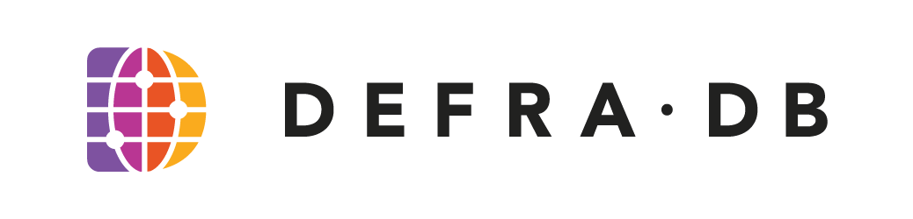

[](https://codecov.io/gh/sourcenetwork/defradb)

<p align="center">

</p>

DefraDB is a peer-to-peer edge document database redefining promises of data ownership, personal privacy, and information security, around the user. It features a GraphQL-compatible query language called [DQL](https://docs.source.network/query-specification/query-language-overview). Its data model, enabled by [MerkleCRDTs](https://arxiv.org/pdf/2004.00107.pdf), makes possible a multi-write-master architecture. It is the core data system for the [Source](https://source.network/) ecosystem. It is built with technologies like [IPLD](https://docs.ipld.io/) and [libP2P](https://libp2p.io/), and featuring Web3 and semantic properties.

Read the [Technical Overview](https://docsend.com/view/zwgut89ccaei7e2w/d/bx4vu9tj62bewenu) and documentation on [docs.source.network](https://docs.source.network/).


## Table of Contents

* [Early Access](#early-access)
* [Install](#install)
* [Start](#start)
* [Configuration](#configuration)
* [Add a schema type](#add-a-schema-type)
* [Create a document instance](#create-a-document-instance)
* [Query documents](#query-documents)
* [Obtain document commits](#obtain-document-commits)
* [Query language documentation](#query-language-documentation)
* [Peer\-to\-peer data synchronization](#peer-to-peer-data-synchronization)
* [Licensing](#licensing)
* [Contributors](#contributors)


## Early Access

DefraDB is currently in a *Early Access Alpha* program, and is not yet ready for production deployments. Please email the [Source](https://source.network/) team at [hello@source.network](mailto:hello@source.network) for support with your use-case and deployment.


## Install

Install `defradb` by [downloading an executable binary](https://github.com/sourcenetwork/defradb/releases), or building it locally using the [Go toolchain](https://golang.org/):
```sh
git clone git@github.com:sourcenetwork/defradb.git
cd ./defradb
make install
```

We assume here that `defradb` is included in your `PATH`, by installing using the Go toolchain and having Go's executables included in `PATH`. That is: `export PATH=$PATH:$(go env GOPATH)/bin`.

We recommend to play around with queries using a native GraphQL client. GraphiQL is a popular option - [download and install it](https://www.electronjs.org/apps/graphiql).


## Start

Start a node by executing `defradb start`. Keep the node running going through the following examples.

Verify connection to the node works, by executing `defradb client ping` in another terminal.


## Configuration

In this document, we use the default configuration, which has the following behavior:

- `~/.defradb/` is DefraDB's configuration and data directory
- `client` command interacts with the locally running node
- the GraphQL endpoint is provided at http://localhost:9181/api/v0/graphql

The GraphQL endpoint can be used with a GraphQL client (e.g. GraphiQL) to conveniently perform requests (`query`, `mutation`) and obtain schema introspection.


## Add a schema type

Schemas are used to structure documents using a type system.

In the following examples we'll be using a simple `User` schema type.

Add it to the database:
```shell
defradb client schema add '
  type User {
    name: String 
    age: Int 
    verified: Boolean 
    points: Float
  }
'
```

By adding a schema, DefraDB generates the typed GraphQL endpoints for querying, mutation, introspection.

Find more examples of schema type definitions in the [examples/schema/](examples/schema/) folder.


## Create a document instance

Submit a mutation request to create an instance of the `User` type:
```shell
defradb client query '
  mutation {
      create_User(data: "{\"age\": 31, \"verified\": true, \"points\": 90, \"name\": \"Bob\"}") {
          _key
      }
  }
'
```


Expected response:
```json
{
  "data": [
    {
      "_key": "bae-91171025-ed21-50e3-b0dc-e31bccdfa1ab",
    }
  ]
}
```

The document key, `_key`, is a unique identifier added to each document in a DefraDB node. It is generated with a combination of [UUIDs](https://en.wikipedia.org/wiki/Universally_unique_identifier) and [CIDs](https://docs.ipfs.io/concepts/content-addressing/).


## Query documents

Once we have populated our local node with data, we can query that data:
```shell
defradb client query '
  query {
    User {
      _key
      age
      name
      points
    }
  }
'
```

The query obtains *all* users and returns their fields `_key, age, name, points`. GraphQL queries only ever return the exact fields you request, there's no `*` selector like with SQL.

We can further filter our results by adding a `filter` argument to the query.
```shell
defradb client query '
  query {
    User(filter: {points: {_ge: 50}}) {
      _key
      age
      name
      points
    }
  }
'
```

This will return only user documents which have a value for the `points` field *Greater Than or Equal to* (`_ge`) 50.


## Obtain document commits

Internally, data is handled by MerkleCRDTs, which convert all mutations and updates a document has into a graph of changes; similar to Git. The graph is a [MerkleDAG](https://docs.ipfs.io/concepts/merkle-dag/), which means all graph nodes are content-identifiable, and each graph node references its parents' content identifiers (CIDs).

To get the most recent commit in the MerkleDAG for a document with a document key of `bae-91171025-ed21-50e3-b0dc-e31bccdfa1ab`:
```shell
defradb client query '
  query {
    latestCommits(dockey: "bae-91171025-ed21-50e3-b0dc-e31bccdfa1ab") {
      cid
      delta
      height
      links {
        cid
        name
      }
    }
  }
'
```

It returns a structure similar to the following, which contains the update payload that caused this new commit (delta), and any subgraph commits it references.
```json
{
  "data": [
    {
      "cid": "bafybeidembipteezluioakc2zyke4h5fnj4rr3uaougfyxd35u3qzefzhm",
      "delta": "pGNhZ2UYH2RuYW1lY0JvYmZwb2ludHMYWmh2ZXJpZmllZPU=",
      "height": 1,
      "links": [
        {
          "cid": "bafybeieelb43ol5e5jiick2p7k4p577ph72ecwcuowlhbops4hpz24zhz4",
          "name": "age"
        },
        {
          "cid": "bafybeigwjkwz7eobh6pqjal4yfpsahnv74cxedxqnmhnmp3iojoc4xs25i",
          "name": "name"
        },
        {
          "cid": "bafybeigr72knx43euvxz34sqipjrfpcgibr7uuihko4aqxqutkkmzhqm24",
          "name": "points"
        },
        {
          "cid": "bafybeig653zyvev625vkn5kveuhyzqnychvoqhyx52pznbre227olkzkpi",
          "name": "verified"
        }
      ]
    }
  ]
}
```

Obtain a specific commit by its content identifier (CID):
```gql
defradb client query '
  query {
    commit(cid: "bafybeidembipteezluioakc2zyke4h5fnj4rr3uaougfyxd35u3qzefzhm") {
      cid
      delta
      height
      links {
        cid
        name
      }
    }
  }
'
```

Here, you can see the CID from the previous query being used to further explore the related nodes in the MerkleDAG.


## Query language documentation

Read the full DefraDB Query Language documentation on [docs.source.network](https://docs.source.network/query-specification/query-language-overview).

Doing so, you will discover about filtering, ordering, limiting, relationships, variables, aggregate functions, and further useful features.


## Peer-to-peer data synchronization
DefraDB uses peer-to-peer networking for nodes to exchange, synchronize, and replicate documents and commits.

When starting a node for the first time, a key pair is generated and stored in its "root directory" (commonly `~/.defradb/`).

Each node has a unique `Peer ID` generated from its public key. This ID allows other nodes to connect to it.

There are two types of peer-to-be relationships nodes support: **pubsub** peering and **replicator** peering.

Pubsub peering *passively* synchronizes data between nodes by broadcasting Document Commit updates with the document key (`DocKey`) as the topic. Nodes need to already be listening on the pubsub channel to receive updates. This is for when two nodes *already* have a shared document and want to keep both their changes in sync with one another.

Replicator peering *actively* pushes changes from a specific collection *to* a target peer.


### Pubsub example

Pubsub peers can be specified on the command line using the `--peers` flag which accepts a comma-separated list of peer [multiaddress](https://docs.libp2p.io/concepts/addressing/). For example, a node at `192.168.1.12` listening on 9000 with Peer ID `12D3KooWNXm3dmrwCYSxGoRUyZstaKYiHPdt8uZH5vgVaEJyzU8B` would be referred to using the multiaddress  `/ip4/192.168.1.12/tcp/9000/p2p/12D3KooWNXm3dmrwCYSxGoRUyZstaKYiHPdt8uZH5vgVaEJyzU8B`.

Let's go through an example of two nodes (*nodeA* and *nodeB*) connecting with each other over pubsub, on the same machine.

Start *nodeA* with a default configuration:
```
defradb start
```

Obtain the Peer ID from its console output. In this example, we assume `12D3KooWNXm3dmrwCYSxGoRUyZstaKYiHPdt8uZH5vgVaEJyzU8B`, but locally it will be different.

For *nodeB*, we provide the following configuration:
```
defradb start --rootdir ~/.defradb-nodeB --url localhost:9182 --p2paddr /ip4/0.0.0.0/tcp/9172 --tcpaddr /ip4/0.0.0.0/tcp/9162 --peers /ip4/0.0.0.0/tcp/9171/p2p/12D3KooWNXm3dmrwCYSxGoRUyZstaKYiHPdt8uZH5vgVaEJyzU8B
```

About the flags:

- `--rootdir` specifies the root dir (config and data) to use
- `--url` is the address to listen on for the client HTTP and GraphQL API
- `--p2paddr` is the multiaddress for the p2p networking to listen on
- `--tcpaddr` is the multiaddress for the gRPC server to listen on
- `--peers` is a comma-separated list of peer multiaddresses

This starts two nodes and connect them via pubsub networking.


### Replicator example

Replicator peering is established in one direction. For example, a *nodeA* can be given a *nodeB* to actively send updates to, but *nodeB* won't send updates in return. However, nodes broadcast updates of documents over document-specific pubsub topics, therefore *nodeB* while it won't replicate directly to *nodeA*, it will *passively*.

Let's go through an example of *nodeA* actively replicating to *nodeB*:

Start *nodeA*:
```shell
defradb start
```

In another terminal, add this example schema to it:
```shell
defradb client schema add '
  type Article {
    content: String
    published: Boolean
  }
'
```

Start *nodeB*, that will be receiving updates:
```shell
defradb start --rootdir ~/.defradb-nodeB --url localhost:9182 --p2paddr /ip4/0.0.0.0/tcp/9172 --tcpaddr /ip4/0.0.0.0/tcp/9162
```

Notice how we *do not* specify `--peers` as we will manually define a replicator after startup via the `rpc` client command.

In another terminal, add the same schema to *nodeB*:
```shell
defradb client schema add --url localhost:9182 '
  type Article {
    content: String
    published: Boolean
  }
'
```

Set *nodeA* to actively replicate the "Article" collection to *nodeB*:
```shell
defradb client rpc addreplicator "Article" /ip4/0.0.0.0/tcp/9162/p2p/<peerID_of_nodeB>
```

As we add or update documents in the "Article" collection on *nodeA*, they will be actively pushed to *nodeB*. Note that changes to *nodeB* will still be passively published back to *nodeA*, via pubsub.


## Licensing

DefraDB's code is released under the [Business Source License (BSL)](licenses/BSL.txt). It grants you the right to copy, modify, create derivative works, redistribute, and make non-production use of it. For additional uses, such as deploying in production on a private network, please contact license@source.network for a licensing agreement. Each dated version of the license turns into an Apache License v2.0 after 4 years. Please read the complete license before usage.


## Contributors

- John-Alan Simmons ([@jsimnz](https://github.com/jsimnz))
- Andrew Sisley ([@AndrewSisley](https://github.com/AndrewSisley))
- Shahzad Lone ([@shahzadlone](https://github.com/shahzadlone))
- Orpheus Lummis ([@orpheuslummis](https://github.com/orpheuslummis))
- Fred Carle ([@fredcarle](https://github.com/fredcarle))

You are invited to contribute to DefraDB. Follow the [Contributing guide](./CONTRIBUTING.md) to get started.
