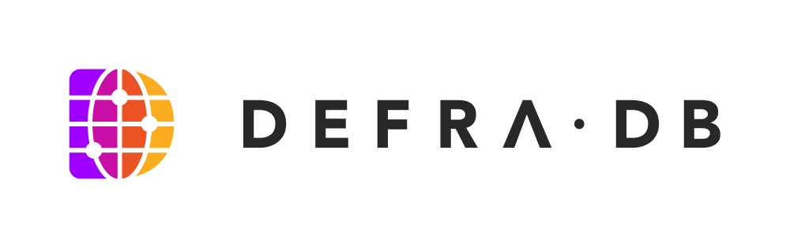

 

#
The DefraDB is a Peer-to-Peer Edge Database, with the interface of a NoSQL Document Store. DefraDB's data model is backed by [MerkleCRDTs](https://arxiv.org/pdf/2004.00107.pdf) for a multi write-master architecture. It is the core data storage system for the [Source](https://source.network/) Ecosystem, built with [IPFS](https://ipfs.io/) technologies like [IPLD](https://docs.ipld.io/) and [LibP2P](https://libp2p.io/) and featuring Semantic web3 properties.

## Design Doc
https://docs.google.com/document/d/10_7DiLFOOyTXBSM2wSsQxmcT9f1h44GBS3KIPDHs8n4/edit# (Private)

## Query Specfication Doc
[https://hackmd.io/@source/BksQY6Qfw](https://hackmd.io/@source/BksQY6Qfw)

## Technical Specification Doc
[https://hackmd.io/ZEwh3O15QN2u4p0cVoGbxw](https://hackmd.io/ZEwh3O15QN2u4p0cVoGbxw) (Private)

## Licensing

## Contributors
- John-Alan Simmons ([@jsimnz](https://github.com/jsimnz))
