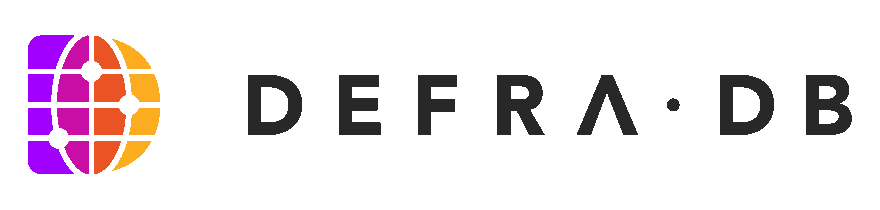

 

#
The DefraDB is NoSQL Document Store which is simultaneously a Peer to Peer and Client/Server database model backed by CRDTs for a multi write-master architecture. It is the core data storage system for the Source Platform, built with IPFS/IPLD and featuring Semantic web3 properties.

### Design Doc
https://docs.google.com/document/d/10_7DiLFOOyTXBSM2wSsQxmcT9f1h44GBS3KIPDHs8n4/edit#

### Contributors
- John-Alan Simmons ([@jsimnz](https://github.com/jsimnz))
